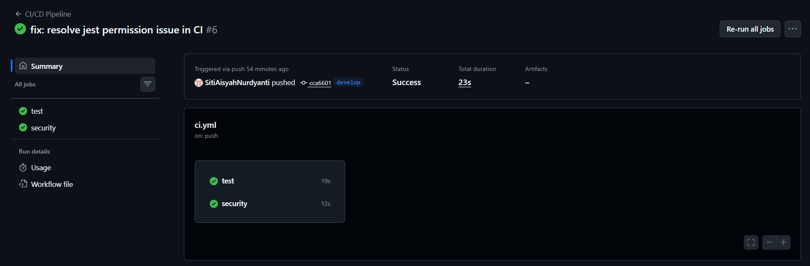

# Movie Watchlist API


---

## 1. Deskripsi Project

Movie Watchlist API adalah sebuah RESTful API yang digunakan untuk mengelola data daftar film (movie watchlist). API ini mendukung operasi CRUD (Create, Read, Update, Delete) untuk menambahkan, melihat, memperbarui, dan menghapus data film.

API ini dibangun menggunakan:
- Node.js
- Express.js
- Jest & Supertest (Unit Testing)
- GitHub Actions (CI/CD)
- Docker (Containerization)

---

## 2. Dokumentasi API

### Base URL: http://localhost:3000

### Endpoint List

#### 1. GET /movies
Mendapatkan semua data movie.

**Response Success**
```json
{
  "status": "success",
  "data": [
    {
      "id": 1,
      "title": "Inception",
      "genre": "Sci-Fi, Thriller",
      "category": "western",
      "rating": 8,
      "status": "plan"
    },
    {
      "id": 2,
      "title": "Oblivion Battery",
      "genre": "Sport, Slice of Life",
      "category": "Animation",
      "rating": 9,
      "status": "completed"
    }
  ]
}
```
#### 2. GET /movies/:id

Mendapatkan data movie berdasarkan ID.

Response Success
```json
{
  "status": "success",
  "data": {
    "id": 1,
    "title": "Inception",
    "genre": "Sci-Fi, Thriller",
    "category": "western",
    "rating": 8,
    "status": "plan"
  }
}
```
Response Error
```json
{
  "status": "error",
  "message": "Movie not found"
}
```
#### 3. POST /movies

Menambahkan movie baru.

Request Body
```json
{
  "title": "Inception",
  "genre": "Sci-Fi, Thriller",
  "category": "western",
  "rating": 8,
  "status": "plan"
}
```
Response Success
```json
{
  "status": "success",
  "message": "Movie added",
  "data": {
    "id": 1,
    "title": "Inception",
    "genre": "Sci-Fi, Thriller",
    "category": "western",
    "rating": 8,
    "status": "plan"
  }
}
```
#### 4. PUT /movies/:id

Mengupdate data movie.

Request Body
```json
{
  "genre": "Sport, Slice of Life, Comedy"
}
```
Response Success
```json
{
  "status": "success",
  "message": "Movie updated",
  "data": {
    "id": 2,
    "title": "Oblivion Battery",
    "genre": "Sport, Slice of Life, Comedy",
    "category": "Animation",
    "rating": 9,
    "status": "completed"
  }
}
```
#### 5. DELETE /movies/:id

Menghapus data movie.

Response Success
```json
{
  "status": "success",
  "message": "Movie deleted"
}
```

Response Error
```json
{
  "status": "error",
  "message": "Movie not found"
}
```

---

## 3. Panduan Instalasi (Docker)

Gunakan perintah di bawah ini untuk menjalankan aplikasi di dalam container. Pastikan Docker Desktop sudah dalam keadaan aktif.

### Perintah Docker
* **Build dan Run:** `docker-compose up --build`
* **Menjalankan Container:** `docker-compose up`
* **Stop Container:** `docker-compose down`

### Port Mapping
Untuk mengakses API, pastikan port berikut tidak terpakai oleh aplikasi yang lain:

| Komponen | Port |
| :--- | :--- |
| **Host** | 3000 |
| **Container** | 3000 |

### Aplikasi dapat diakses melalui:
http://localhost:3000

---

## 4. Alur Kerja Git

Project ini menggunakan strategi **Git Flow** sederhana untuk mengelola siklus pengembangan kode.

### Strategi Branching
Setiap perubahan kode harus dilakukan pada branch yang sesuai:

| Branch | Fungsi | Target |
| :--- | :--- | :--- |
| `main` | Production | Kode stabil yang siap deploy |
| `develop` | Development | Tempat integrasi fitur baru sebelum ke main |
| `feature/*` | Feature | Pengembangan fitur spesifik (contoh: `feature/init-project`) |


### Conventional Commits
Untuk menjaga kerapian riwayat commit, project ini mengikuti standar **Conventional Commits**. Pastikan pesan commit kamu mengikuti format berikut:

- `feat:` Menambahkan fitur baru (contoh: `feat: implement CRUD movie API`)
- `fix:` Memperbaiki bug atau error (contoh: `fix: resolve jest permission issue in CI`)
- `test:` Menambahkan atau memperbaiki testing (contoh: `test: add CRUD unit tests`)


---

## 5. Status Automasi (GitHub Actions)

Project ini mengimplementasikan **CI/CD Automation** menggunakan GitHub Actions.

### - CI (Continuous Integration)
Workflow ini akan berjalan secara otomatis setiap kali terjadi **Push** ke branch `develop`/`main` atau saat pembuatan **Pull Request**.

**Tahapan yang dijalankan:**
* **Environment Setup:** Menyiapkan runtime Node.js.
* **Install Dependencies:** Menjalankan `npm install`.
* **Unit Testing:** Validasi logika kode menggunakan **Jest** dan **Supertest**.

### - CS (Continuous Security)
Untuk menjaga keamanan aplikasi, workflow juga menjalankan pemindaian kerentanan:
* **Dependency Audit:** Menjalankan `npm audit --audit-level=high`.

---

### Konfigurasi
* **Lokasi Workflow File:** `.github/workflows/ci.yml`
* **Bukti Github Action:**

 

---
Nama: Siti Aisyah Nurdyanti
NPM: 140810230015
